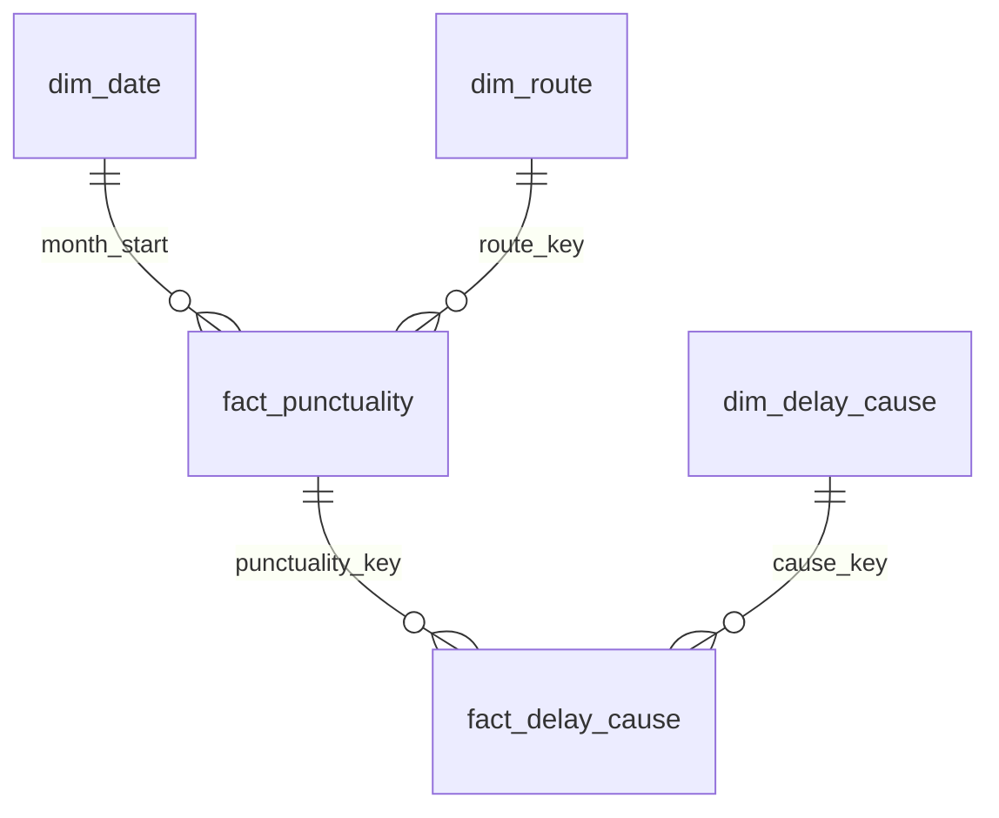

# Data model (TGV star schema)

Source: `regularite-mensuelle-tgv-aqst` (TGV punctuality by route, monthly, 2018-01 onward).
Built with dbt in `dbt/`; marts are written to `data/marts/*.parquet` for Qlik.

## Tables

| Table | Grain | Rows (approx.) |
|---|---|---:|
| `fact_punctuality` | month × route × service | 12,500 |
| `fact_delay_cause` | punctuality row × delay cause | 6 per row with cause data |
| `dim_route` | service × origin × destination | 146 |
| `dim_date` | month | 102 |
| `dim_delay_cause` | delay cause | 6 |

## Design decisions

**Service is part of the grain.** In 2025-07 to 2025-09 the same origin-destination pair (e.g. Dijon → Paris Lyon)
is reported under both `National` and `International` with different counts. Service is therefore part of the
route key, not a label on the route. National and International rows must never be summed together.

**Only additive measures are stored.** Rates and averages cannot be summed or averaged across routes or months
(a monthly average of rates gives a small route the same weight as Paris–Marseille). The fact stores counts and
total delay minutes (`average × number of trains`); every rate and average is computed as `Sum(...) / Sum(...)`.

**Monthly calendar.** The source is monthly; a daily calendar would suggest a precision the data does not have.

**Causes as a separate fact.** The six cause columns are unpivoted so "cause" can be used as a dimension
(one chart, one filter). `fact_delay_cause` links to `fact_punctuality` through a single key and carries no
month or route key itself: two tables sharing two keys would create a synthetic key in Qlik.

## Definitions and known limits

- **Punctuality rate** = 1 − trains late at arrival / trains that ran. The lateness threshold used by SNCF is
  not published in the dataset, so the KPI is named "taux de régularité à l'arrivée (seuil SNCF)".
  It tracks the official *régularité composite* (`tgv_national_monthly`) but is lower by a few points
  (June 2024: 86.1 vs 88.0), because that indicator is defined differently.
- **Cause shares** are a mix within one row; their denominator is not published. The implied denominator
  matches "trains late at arrival" in only 36–73 % of rows depending on the year. Across rows, causes are weighted by trains
  late at arrival (`est_late_trains`); this is an approximation and is labelled as such.
- **Disrupted months** (`dim_date.is_disrupted`, `disruption`): months when planned National TGV trains fell
  below 75 % of the February 2020 level (seed `disrupted_months.csv`):
  2019-12 (50 %, national strike against the pension reform), 2020-03..06 and 2020-10..11 (COVID, 11–72 %).
  2020-12 (79 %) is not flagged. Exclude or mark these months in trends and forecasts.

## Cleaning rules (staging)

From `docs/data_quality.md`:

| Problem | Rule | Rows |
|---|---|---:|
| Revised rows (same key, loaded twice) | keep the latest `_loaded_at` | 0 today |
| Cancellations > planned (COVID 2020) | `trains_ran` null | 63 |
| Negative train counts | null | 43 |
| Delay buckets break late ≥ >15 ≥ >30 ≥ >60 ≥ 0 | all three buckets null | 388 |
| Negative average delay of late trains | null | 2 |
| Average delay of all trains < −15 min | null (−0 to −8.8 is plausible early running; the 11 rows below −15 fall in 2019-10..2020-02, down to −472) | 11 |
| All cause shares = 0 | causes null (missing, not zero) | 270 |
| `retard_moyen_trains_retard_sup15` | dropped (mirrors another column in 2018–2019) | — |
| Empty comment columns | dropped | — |

Test `assert_late_trains_within_trains_ran` guarantees that `Sum(late) / Sum(ran)` never counts a late train
without its trains ran.
